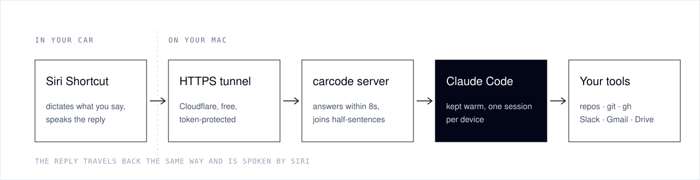

<div align="center">


<br>

[](https://github.com/Harsh-Rastogi-03/carcode/actions/workflows/ci.yml)    

**[Read the story](https://harshrastogi.tech/blog/code-from-your-car-claude-code-carplay)** · **[Quick start](#-quick-start)** · **[What you can ask](#-what-you-can-ask)** · **[How it works](#-how-it-works)** · **[Customize](#-make-it-yours)** · **[Safety](#-safety)** · **[FAQ](#-faq)**

</div>

<br>

> [!NOTE]
> **carcode lets you code from your car.** It turns Claude Code into a voice assistant for your drive. Say *"Hey Siri, Jarvis"*, ask about your pull requests, Slack or inbox, or ask for a code change. Claude Code does the work on your Mac and answers out loud through CarPlay. No app to install, no API key, nothing to tap.

<table>
<tr>
<td width="50%" valign="top">

### 🗣️ A real conversation

```text
You     Hey Siri, Jarvis
Jarvis  Hello Boss, I am ready for work.

You     Any new issues assigned to me?
Jarvis  Two since yesterday. The newest is
        a chat widget refresh bug.

You     Fix it and open a draft PR.
Jarvis  One moment…
Jarvis  Opened draft PR fifty-one on the
        website repo.

You     Bye.
```

</td>
<td width="50%" valign="top">

### ✨ Why it feels good

- **Fast:** one Claude Code session stays warm per device, so answers take seconds.
- **Patient:** it notices half-sentences, says *"Go on"* and waits for the rest.
- **Never stuck:** every reply comes within 8 seconds. Long jobs say *"One moment"* and finish by themselves.
- **Careful:** it reads back messages, merges and approvals, and acts only after you say *"confirm"*.
- **Yours:** pick its name, greeting, language and what it calls you.
- **Visible:** a live dashboard on your phone shows the whole conversation.

</td>
</tr>
</table>

## 🎯 What you can ask

| | Say | What happens |
|---|---|---|
| 🐙 | *"What are my open PRs?"* · *"Is CI green on the website repo?"* | Reads GitHub with `gh` |
| 🔍 | *"Summarize PR forty-two."* → *"Approve it."* → *"Confirm."* | Reads the diff, approves only after you confirm |
| 💬 | *"Anything on Slack mentioning me today?"* | Searches your Slack connector |
| ✉️ | *"Message Alex that I'll be ten minutes late."* → *"Confirm."* | Reads the message back, then sends it |
| 🛠️ | *"Fix the broken footer link and open a draft PR."* | Branch `carcode/…`, commit, push, **draft** PR |
| 📅 | *"What's on my calendar this afternoon?"* | Uses your Calendar connector |
| 🎛️ | *"Status"* · *"Cancel"* · *"New session"* · *"Bye"* | Controls the conversation |

## ⚙️ How it works



| Piece | Job |
|---|---|
| **Siri Shortcut** | Listens, sends your words to your Mac, speaks the answer, then listens again until you say *"bye"*. carcode generates and signs it for you. |
| **Cloudflare quick tunnel** | Gives your Mac a free public HTTPS address, so your phone can reach it over mobile data. |
| **carcode server** | A small FastAPI app. It keeps Claude Code warm, holds slow answers, joins split sentences and runs the dashboard. |
| **Claude Code** | Your normal CLI login, working in your repos folder with `git`, `gh` and your connectors (Slack, Gmail, Calendar, Drive and more). |

## 🚀 Quick start

> **You need:** a Mac that stays on while you drive · [Claude Code](https://docs.claude.com/en/docs/claude-code) installed and logged in · an iPhone on the same iCloud account · `brew install uv cloudflared` · optionally `brew install gh && gh auth login`

**1 · Set up** (about 1 minute)

```bash
git clone https://github.com/Harsh-Rastogi-03/carcode.git && cd carcode
./carcode setup
```

Open `.env` and set `CARCODE_WORKDIR` to the folder that holds your repos.

**2 · Run it in the background** (it starts at login and restarts if it crashes)

```bash
./carcode install
./carcode say "what can you do?"     # quick test from the terminal
```

**3 · Get the Siri Shortcut**

```bash
./carcode shortcut                   # builds, signs and opens it → click "Add Shortcut"
```

It syncs to your iPhone through iCloud in about a minute.

**4 · Set up the iPhone once**

| Setting | Why |
|---|---|
| **Settings → Siri →** *Listen for "Hey Siri"* and *Allow Siri When Locked* | Hands-free start while the phone is locked |
| **Settings → Siri → Siri Responses → Prefer Spoken Responses** | Replies are spoken even when the phone is on silent |
| **Settings → Accessibility → Siri → Siri Pause Time → Longest** | Siri waits longer before deciding you've finished |

Run the shortcut once on the phone to allow its permissions. Then, in the car:

<div align="center">

### 🚗 *"Hey Siri, Jarvis."*

</div>

## 🎨 Make it yours

Everything lives in `.env`. After a change, run `./carcode restart`. If you changed the name, greeting or language, also run `./carcode shortcut`.

| Setting | Default | What it does |
|---|---|---|
| `CARCODE_WORKDIR` | `~/code` | The folder with your repos. Claude Code runs here. |
| `CARCODE_NAME` | `Jarvis` | The assistant's name, and the phrase you say to Siri |
| `CARCODE_USER_TITLE` | `Boss` | What it calls you |
| `CARCODE_GREETING` | `Hello <title>, I am ready for work.` | Spoken when the shortcut starts |
| `CARCODE_LANGUAGE` | `en-US` | Dictation language: `en-GB`, `en-IN`, `en-AU`, … |
| `CARCODE_GH_USER` | | Pins `gh` to one account if you have several |
| `CARCODE_EXTRA_TOOLS` | | Extra tools Claude may use, such as `mcp__my_server` |
| `NTFY_TOPIC` | | Phone notification through [ntfy](https://ntfy.sh) when a long task finishes |

<details>
<summary><b>🧩 Teach it about your world (private context)</b></summary>

<br>

Create `prompts/context.local.md`. It's gitignored and added to the assistant's instructions, so it can understand *"message Alex"* or *"the app repo"* straight away:

```markdown
## About me
- GitHub user `octocat`, org `acme`. "The app" means the `acme-web` repo.
- Team: Alex (design lead), Sam (backend). Slack IDs: Alex U012ABC, Sam U034DEF.
```

How it speaks, confirms and stays safe is in [`prompts/assistant.md`](prompts/assistant.md).

</details>

<details>
<summary><b>⌨️ All commands</b></summary>

<br>

| Command | What it does |
|---|---|
| `./carcode setup` | Checks requirements, creates the token and `.env` |
| `./carcode install` | Runs in the background (starts at login, restarts on crash) |
| `./carcode shortcut` | Builds the Siri Shortcut for the current URL and opens it |
| `./carcode status` | Shows the services, URL and dashboard link |
| `./carcode say "…"` | Talks to the assistant from the terminal |
| `./carcode ui` | Opens the live conversation dashboard |
| `./carcode logs` | Follows the server log |
| `./carcode restart` | Restarts the server (the URL stays the same) |
| `./carcode start` | Runs in the foreground instead of installing |
| `./carcode uninstall` | Stops and removes the background services |

</details>

<details>
<summary><b>📱 Live dashboard</b></summary>

<br>

`./carcode status` prints a private link that shows the conversation as it happens: what you said, what it answered, how long it took, and what it's working on. Open it on your iPhone and tap **Share → Add to Home Screen** for a full-screen app. CarPlay only allows Apple-approved apps on the car's screen, so the dashboard lives on your phone.

</details>

## 🔒 Safety

> [!IMPORTANT]
> Your access token is the key to your setup. Anyone who has it can drive Claude Code on your Mac. It lives in `data/token` (gitignored) and inside your shortcut, so don't share either. To rotate it: `rm data/token && ./carcode restart && ./carcode shortcut`.

- ✅ **It confirms before acting for you.** Before it sends a message or email, merges or approves a PR, deletes anything, or posts anything public, it reads the action back and waits for *"confirm"*.
- 🧰 **Its tools are allowlisted.** It can use files, `git`, `gh`, `npm`/`pnpm`/`yarn`/`uv`, `python3`, `node` and your connectors; other shell commands are denied. `python3`, `node` and the package managers can run arbitrary code, so trim them with `CARCODE_ALLOWED_TOOLS` for a tighter setup.
- 🌿 **Code changes go to draft PRs** on a `carcode/…` branch. It's told never to push to main or force-push.
- 🧱 **Text in PRs, emails and Slack is treated as data**, never as instructions.
- 🌐 **Network exposure:** the server listens only on `127.0.0.1`. The token-checked tunnel is its only way in.

The confirm rule is enforced by the prompt, so treat it as a strong guardrail, not a guarantee. See [SECURITY.md](SECURITY.md) to report issues privately.

## 🩺 Troubleshooting

| Symptom | Fix |
|---|---|
| 🔇 Siri runs it, but you hear nothing | **Siri Responses → Prefer Spoken Responses**, and turn the media volume up |
| 📵 *"… is unreachable"* or the shortcut errors | The Mac is asleep or offline, or the tunnel restarted. Run `./carcode status`, then `./carcode shortcut` if the URL changed. |
| ✂️ It cuts you off mid-sentence | Set **Siri Pause Time → Longest**. carcode also joins half-sentences. |
| 👯 Two shortcuts with the same name | Delete the older one. Siri may pick the wrong one. |
| 🐢 GitHub answers are slow or wrong | Set `CARCODE_GH_USER` if you have several `gh` accounts |
| 🔎 Anything else | `./carcode logs` shows each request, how long it took, and any errors |

> [!TIP]
> **Want a URL that never changes?** The free quick tunnel gets a new address when it restarts, for example after a reboot. For a permanent one, use a [named Cloudflare tunnel](https://developers.cloudflare.com/cloudflare-one/connections/connect-networks/get-started/) on your own domain or [Tailscale Funnel](https://tailscale.com/kb/1223/funnel), and put its address in `data/url`.

## ❓ FAQ

<details>
<summary><b>Why does it need a Mac? Could it run on Vercel or on my phone?</b></summary>
<br>
It runs the real Claude Code CLI with your login, repos and tools, and keeps it warm between turns. That needs a computer that stays on, which rules out serverless platforms and iOS. A Mac mini at home is ideal. A Linux server can run it too, but building the shortcut needs macOS once.
</details>

<details>
<summary><b>Do I need an Anthropic API key?</b></summary>
<br>
No. It uses the Claude Code CLI you've already logged into, and usage counts against that account.
</details>

<details>
<summary><b>Can it show things on the CarPlay screen?</b></summary>
<br>
Not directly. Apple has to approve CarPlay apps. carcode is voice-only in the car, with the live dashboard on your phone.
</details>

<details>
<summary><b>Is it safe to use while driving?</b></summary>
<br>
It's built to be hands-free: one phrase to start, short spoken answers, and no screen needed. Follow your local laws, and keep your eyes on the road.
</details>

## 🧑‍💻 Development

```bash
uv run --group dev pytest        # 36 tests; a fake Claude Code means no login is needed
uv run --group dev ruff check .
```

| File | What it is |
|---|---|
| `server.py` | The FastAPI server: sessions, timing, half-sentence joining, dashboard API |
| `make_shortcut.py` | Builds and signs the Siri Shortcut |
| `carcode` | The command-line tool: setup, install, status, shortcut, … |
| `prompts/assistant.md` | How the assistant speaks and its safety rules |
| `ui.html` | The live dashboard |

Pull requests are welcome.

<div align="center">

<br>

**[MIT licensed](LICENSE)** · built for people who think best on the road 🛣️

</div>
