<p align="center">
  <a href="#install"><b>Install</b></a>&nbsp;&nbsp;·&nbsp;&nbsp;<a href="#try-it-without-a-car">Try it without a car</a>&nbsp;&nbsp;·&nbsp;&nbsp;<a href="#what-you-can-ask">What you can ask</a>&nbsp;&nbsp;·&nbsp;&nbsp;<a href="#how-it-works">How it works</a>&nbsp;&nbsp;·&nbsp;&nbsp;<a href="#safety">Safety</a>&nbsp;&nbsp;·&nbsp;&nbsp;<a href="https://www.harshrastogi.tech/blog/code-from-your-car-claude-code-carplay">The story</a>
</p>

<p align="center">
  <a href="https://github.com/Harsh-Rastogi-03/carcode/actions/workflows/ci.yml"></a>
  
  
  
</p>

**carcode turns Claude Code into a voice assistant for your drive.** Say *"Hey Siri, Jarvis"*, ask about your pull requests, Slack or inbox, or ask for a code change. Claude Code does the work on your Mac and answers out loud through CarPlay. There's no app to install, no API key, and nothing to tap.



## Install

You need a Mac that stays on while you drive, [Claude Code](https://docs.claude.com/en/docs/claude-code) installed and logged in, and an iPhone on the same iCloud account.

```bash
curl -fsSL https://raw.githubusercontent.com/Harsh-Rastogi-03/carcode/main/install.sh | bash
```

The installer checks your Mac, offers to install `uv` and `cloudflared` with Homebrew, asks which folder holds your repos, starts carcode in the background and builds your Siri Shortcut. It takes about two minutes.

**Or let Claude Code install it.** Paste this into Claude Code (or any coding agent):

```text
Install carcode for me: https://github.com/Harsh-Rastogi-03/carcode
Follow the steps in its AGENTS.md.
```

The agent asks for your repos folder and a name, runs the installer, checks everything with `./carcode doctor`, and hands you the two steps only you can do.

**Then, two things by hand:**

1. In the Shortcuts window that opens, click **Add Shortcut**. It syncs to your iPhone through iCloud in about a minute.
2. On your iPhone, open **Settings → Siri**, turn on **Allow Siri When Locked**, and set **Siri Responses** to **Prefer Spoken Responses**. For long questions, set **Accessibility → Siri → Siri Pause Time** to **Longest**.

Now get in the car and say **"Hey Siri, Jarvis."**

<details>
<summary><b>Install manually instead</b></summary>

<br>

```bash
brew install uv cloudflared               # and optionally: brew install gh && gh auth login
git clone https://github.com/Harsh-Rastogi-03/carcode.git && cd carcode
./carcode setup --workdir ~/code          # your repos folder; also --name, --title, --language
./carcode install                         # runs in the background, starts at login
./carcode shortcut                        # builds the Siri Shortcut and opens it
./carcode doctor                          # checks everything
```

</details>

## Try it without a car

```bash
cd ~/carcode && ./carcode talk
```

Type what you'd say in the car. carcode answers out loud in your terminal with the Mac's voice, and handles long jobs the same way the Shortcut does: *"One moment"*, then the answer when it's ready. Add `--quiet` to read instead of listen.

## What you can ask

| Say | What happens |
|---|---|
| *"What are my open PRs?"* · *"Is CI green on the website repo?"* | Reads GitHub with `gh` |
| *"Summarize PR forty-two."* → *"Approve it."* → *"Confirm."* | Reads the diff, approves only after you confirm |
| *"Anything on Slack mentioning me today?"* | Searches your Slack connector |
| *"Message Alex that I'll be ten minutes late."* → *"Confirm."* | Reads the message back, then sends it |
| *"Fix the broken footer link and open a draft PR."* | Branch `carcode/…`, commit, push, **draft** PR |
| *"What's on my calendar this afternoon?"* | Uses your Calendar connector |
| *"Status"* · *"Cancel"* · *"New session"* · *"Bye"* | Controls the conversation |

Why it feels good on the road:

- **Fast.** One Claude Code session stays warm per device, so answers take seconds.
- **Patient.** It notices half-sentences, says *"Go on"* and waits for the rest.
- **Never stuck.** Every reply comes within 8 seconds. Long jobs say *"One moment"* and finish in the background.
- **Careful.** It reads back messages, merges and approvals, and acts only after you say *"confirm"*.
- **Visible.** A live dashboard on your phone shows the whole conversation.

## How it works


| Piece | Job |
|---|---|
| **Siri Shortcut** | Listens, sends your words to your Mac, speaks the answer, then listens again until you say *"bye"*. carcode generates and signs it for you. |
| **Cloudflare quick tunnel** | Gives your Mac a free public HTTPS address, so your phone reaches it over mobile data. |
| **carcode server** | A small FastAPI app. It keeps Claude Code warm, holds slow answers, joins split sentences and runs the dashboard. |
| **Claude Code** | Your normal CLI login, working in your repos folder with `git`, `gh` and your connectors (Slack, Gmail, Calendar, Drive and more). |

## Make it yours

Settings live in `.env`. After a change, run `./carcode restart`; if you changed the name, greeting or language, also run `./carcode shortcut`.

| Setting | Default | What it does |
|---|---|---|
| `CARCODE_WORKDIR` | `~/code` | The folder with your repos. Claude Code runs here. |
| `CARCODE_NAME` | `Jarvis` | The assistant's name, and the phrase you say to Siri |
| `CARCODE_USER_TITLE` | `Boss` | What it calls you |
| `CARCODE_GREETING` | `Hello <title>, I am ready for work.` | Spoken when the shortcut starts |
| `CARCODE_LANGUAGE` | `en-US` | Dictation language: `en-GB`, `en-IN`, `en-AU`, … |
| `CARCODE_GH_USER` | | Pins `gh` to one account if you have several |
| `CARCODE_EXTRA_TOOLS` | | Extra tools Claude may use, such as `mcp__my_server` |
| `NTFY_TOPIC` | | Phone notification through [ntfy](https://ntfy.sh) when a long task finishes |

**Teach it about your world.** Create `prompts/context.local.md` (gitignored). It's added to the assistant's instructions, so it understands *"message Alex"* or *"the app repo"* straight away:

```markdown
## About me
- GitHub user `octocat`, org `acme`. "The app" means the `acme-web` repo.
- Team: Alex (design lead), Sam (backend). Slack IDs: Alex U012ABC, Sam U034DEF.
```

How it speaks, confirms and stays safe is in [`prompts/assistant.md`](prompts/assistant.md).

## Commands

| Command | What it does |
|---|---|
| `./carcode talk` | Talk to it out loud in the terminal, no phone needed |
| `./carcode doctor` | Checks the whole setup and shows how to fix problems (`--json` for scripts and agents) |
| `./carcode status` | Shows the services, URL and dashboard link |
| `./carcode say "…"` | Sends one message and prints the reply |
| `./carcode shortcut` | Builds the Siri Shortcut for the current URL and opens it |
| `./carcode ui` | Opens the live conversation dashboard |
| `./carcode logs` | Follows the server log |
| `./carcode setup` | Checks requirements, creates the token and `.env` (`--workdir`, `--name`, `--title`, `--language`) |
| `./carcode install` / `uninstall` | Starts or removes the background services |
| `./carcode restart` | Restarts the server (the URL stays the same) |
| `./carcode update` | Pulls the latest version and restarts |
| `./carcode start` | Runs in the foreground instead of installing |

The **live dashboard** link from `./carcode status` shows what you said, what it answered and how long it took. Open it on your iPhone and tap **Share → Add to Home Screen** for a full-screen app. CarPlay only allows Apple-approved apps on the car's screen, so the dashboard lives on your phone.

## Safety

> [!IMPORTANT]
> Your access token is the key to your setup: anyone who has it can drive Claude Code on your Mac. It lives in `data/token` (gitignored) and inside your shortcut, so don't share either. To rotate it: `rm data/token && ./carcode restart && ./carcode shortcut`.

- **It confirms before acting for you.** Before it sends a message or email, merges or approves a PR, deletes anything or posts anything public, it reads the action back and waits for *"confirm"*.
- **Its tools are allowlisted.** It can use files, `git`, `gh`, `npm`/`pnpm`/`yarn`/`uv`, `python3`, `node` and your connectors; other shell commands are denied. `python3`, `node` and the package managers can run arbitrary code, so trim them with `CARCODE_ALLOWED_TOOLS` for a tighter setup.
- **Code changes go to draft PRs** on a `carcode/…` branch. It's told never to push to main or force-push.
- **Text in PRs, emails and Slack is treated as data**, never as instructions.
- **Network exposure:** the server listens only on `127.0.0.1`. The token-checked tunnel is its only way in.

The confirm rule is enforced by the prompt, so treat it as a strong guardrail, not a guarantee. See [SECURITY.md](SECURITY.md) to report issues privately.

## Troubleshooting

Start with `./carcode doctor`: it checks every piece and prints the fix for anything that's wrong.

| Symptom | Fix |
|---|---|
| Siri runs it, but you hear nothing | **Siri Responses → Prefer Spoken Responses**, and turn the media volume up |
| *"… is unreachable"* or the shortcut errors | The Mac is asleep or offline, or the tunnel restarted. Run `./carcode doctor`, then `./carcode shortcut` if the URL changed. |
| It cuts you off mid-sentence | Set **Siri Pause Time → Longest**. carcode also joins half-sentences. |
| Two shortcuts with the same name | Delete the older one. Siri may pick the wrong one. |
| GitHub answers are slow or wrong | Set `CARCODE_GH_USER` if you have several `gh` accounts |
| Anything else | `./carcode logs` shows each request, how long it took, and any errors |

**Want a URL that never changes?** The free quick tunnel gets a new address when it restarts, for example after a reboot. For a permanent one, use a [named Cloudflare tunnel](https://developers.cloudflare.com/cloudflare-one/connections/connect-networks/get-started/) on your own domain or [Tailscale Funnel](https://tailscale.com/kb/1223/funnel), and put its address in `data/url`.

## FAQ

<details>
<summary><b>Why does it need a Mac? Could it run on a server or on my phone?</b></summary>
<br>
It runs the real Claude Code CLI with your login, repos and tools, and keeps it warm between turns. That needs a computer that stays on, which rules out serverless platforms and iOS. A Mac mini at home is ideal. A Linux server can run the server too, but building the shortcut needs macOS once.
</details>

<details>
<summary><b>Do I need an Anthropic API key?</b></summary>
<br>
No. It uses the Claude Code CLI you've already logged into, and usage counts against that account.
</details>

<details>
<summary><b>Can it show things on the CarPlay screen?</b></summary>
<br>
Not directly. Apple has to approve CarPlay apps. carcode is voice-only in the car, with the live dashboard on your phone.
</details>

<details>
<summary><b>Is it safe to use while driving?</b></summary>
<br>
It's built to be hands-free: one phrase to start, short spoken answers, and no screen needed. Follow your local laws, and keep your eyes on the road.
</details>

## Development

```bash
uv run --group dev pytest        # 39 tests; a fake Claude Code means no login is needed
uv run --group dev ruff check .
```

| File | What it is |
|---|---|
| `server.py` | The FastAPI server: sessions, timing, half-sentence joining, dashboard API |
| `carcode` | The command-line tool: setup, install, doctor, talk, shortcut, … |
| `install.sh` | The one-line installer |
| `talk.py` | The terminal voice client behind `./carcode talk` |
| `make_shortcut.py` | Builds and signs the Siri Shortcut |
| `prompts/assistant.md` | How the assistant speaks and its safety rules |
| `ui.html` | The live dashboard |
| `AGENTS.md` | Install and operating instructions for AI coding agents |

Pull requests are welcome. See [CHANGELOG.md](CHANGELOG.md) for what changed.

<p align="center"><br><a href="LICENSE">MIT licensed</a> · built by <a href="https://www.harshrastogi.tech">Harsh Rastogi</a> for people who think best on the road</p>
